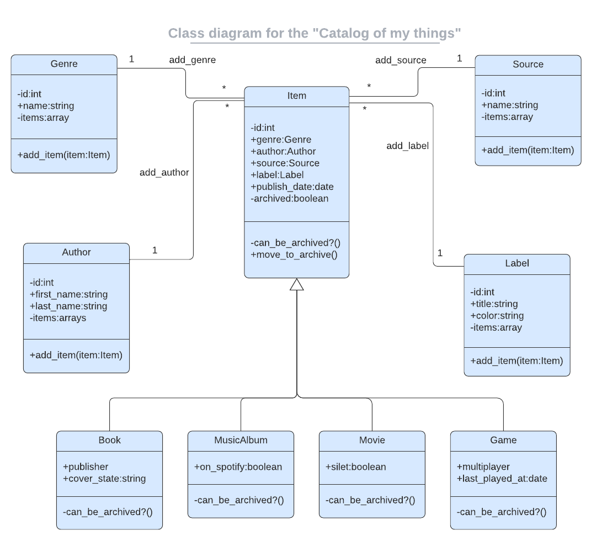

<a id="readme-top"></a>

<div align="center">
<h3><b>Catalog of My Things</b></h3>
</div>

# 📗 Table of Contents

- [📖 About the Project](#about-project)
  - [🛠 Built With](#built-with)
    - [Tech Stack](#tech-stack)
    - [Key Features](#key-features)
  - [🚀 Live Demo](#live-demo)
- [💻 Getting Started](#getting-started)
  - [Setup](#setup)
  - [Prerequisites](#prerequisites)
  - [Install](#install)
  - [Usage](#usage)
  - [Run tests](#run-tests)
  - [Deployment](#deployment)
- [👥 Authors](#authors)
- [🔭 Future Features](#future-features)
- [🤝 Contributing](#contributing)
- [⭐️ Show your support](#support)
- [🙏 Acknowledgements](#acknowledgements)
- [📝 License](#license)

<!-- PROJECT DESCRIPTION -->

# 📖 Catalog of My Things <a id="about-project"></a>

**Catalog of my things** is an application that allows the user to add books, music albums, and games this information is saved in separated JSON files, and the user can display this information in the console.

Adiotionally, there's an schema.sql with tables representing the classes and their associations.


## 🛠 Built With <a id="built-with"></a>

### Tech Stack <a id="tech-stack"></a>

  <ul>
    <li><a href="https://www.ruby-lang.org/en/">Ruby</a></li>
    <li><a href="https://www.postgresql.org/">PostgreSQL</a></li>
  </ul>

<!-- Features -->

### Key Features <a id="key-features"></a>

- **Designclasses following a UML diagram**
- **Modular Code Structure**
- **Constructor Initialization**
- **Full Method Implementation**
- **Dynamic Archiving Logic**
- **Console Application**
- **User-Friendly Interaction**
- **Data Preservation**
- **Schema Definition**

<p align='right'>(<a href="#readme-top">back to top</a>)</p>

## 🚀 Live Demo <a id="live-demo"></a>

- Currently No Available Live Demo

<p align='right'>(<a href="#readme-top">back to top</a>)</p>

<!-- GETTING STARTED -->

## 💻 Getting Started <a id="getting-started"></a>

### Prerequisites

In order to run this project you need to have:

- Installed Ruby.
- If you're using Windows, have installed WSL.
- If you're using MacOS, an option is using UTM.

### Setup

To clone this repository to your desired folder, run the following command: <br>

```
git clone https://github.com/sergio-usma/Ruby-capstone-project.git
```

### Usage

Initialize it with

```
ruby main.rb
```

### Test

To run the tests try the following command:

```
rspec test
```

<p align="right">(<a href="#readme-top">back to top</a>)</p>

<!-- AUTHORS -->

## 👥 Authors <a id="authors"></a>

> Mention all of the collaborators of this project.

👤 **Author**

- GitHub: [@sergio-usma](https://github.com/sergio-usma)
- Twitter: [@VonUsma](https://twitter.com/vonusma)
- LinkedIn: [Sergio Andres Usma](https://www.linkedin.com/in/sergiousma/)

<p align='right'>(<a href="#readme-top">back to top</a>)</p>

<!-- FUTURE FEATURES -->

## 🔭 Future Features <a id="future-features"></a>

> Describe 1 - 3 features you will add to the project.

- [ ] **[new_feature_1]**
- [ ] **[new_feature_2]**
- [ ] **[new_feature_3]**

<p align='right'>(<a href="#readme-top">back to top</a>)</p>

<!-- CONTRIBUTING -->

## 🤝 Contributing <a id="contributing"></a>

Contributions, issues, and feature requests are welcome!

Feel free to check the [issues page](../../issues/).

<p align='right'>(<a href="#readme-top">back to top</a>)</p>

<!-- SUPPORT -->

## ⭐️ Show your support <a id="support"></a>

> Write a message to encourage readers to support your project

If you like this project, please consider supporting us! Your support helps us to continue developing and improving our project for everyone to enjoy. Whether it's a small donation, sharing the project with your friends, or contributing your skills and expertise, every little bit makes a huge difference. With your support, we can create something truly amazing together. Thank you for being a part of our community and helping us to make a difference!

<p align='right'>(<a href="#readme-top">back to top</a>)</p>

<!-- ACKNOWLEDGEMENTS -->

## 🙏 Acknowledgments <a id="acknowledgements"></a>

> Give credit to everyone who inspired your codebase.

I would like to thank...

<p align='right'>(<a href="#readme-top">back to top</a>)</p>

<!-- FAQ (optional) -->

## ❓ FAQ (OPTIONAL) <a id="faq"></a>

> Add at least 2 questions new developers would ask when they decide to use your project.

- **How do I set up the project?**

  - Clone the repository from GitHub.

- **How can I contribute to the project?**

  1. Fork the repository on GitHub.
  2. Create a new branch for your changes using git checkout -b my-feature-branch.
  3. Make your changes and commit them with descriptive commit messages.
  4. Push your changes to your forked repository.
  5. Submit a pull request to the original repository.
  6. Wait for feedback and iterate on your changes as needed.

<p align='right'>(<a href="#readme-top">back to top</a>)</p>

<!-- LICENSE -->

## 📝 License <a id="license"></a>

This project is [MIT](./LICENSE) licensed.

_NOTE: we recommend using the [MIT license](https://choosealicense.com/licenses/mit/) - you can set it up quickly by [using templates available on GitHub](https://docs.github.com/en/communities/setting-up-your-project-for-healthy-contributions/adding-a-license-to-a-repository). You can also use [any other license](https://choosealicense.com/licenses/) if you wish._

<p align='right'>(<a href="#readme-top">back to top</a>)</p>
